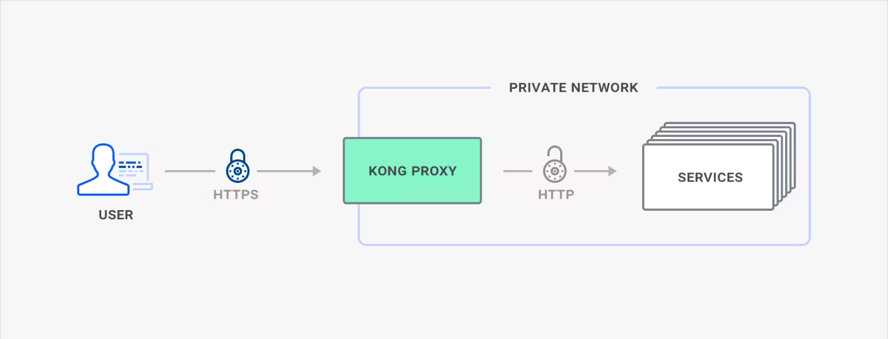

# Kong API gateway ssl termination with self signed certs

- client to gateway connection is secured
- gateway to service connection is not

but services are not directly accessible from outside network, and only gateway can make connections to them [private network]

